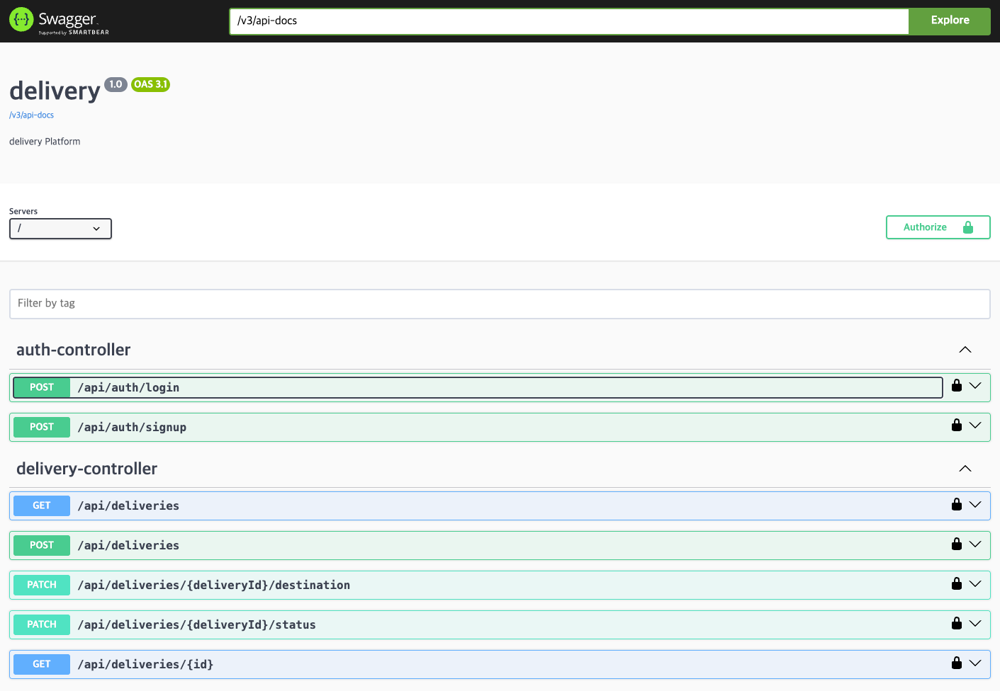

### 제작자
- 이름: 강한규
- 직무: 백엔드 개발자

---

# Delivery Service (배달 REST API)
> 회원 가입, 로그인, 배달 조회, 배달 주문 수정 서비스를 위한 Back-End API 를 정의하고,
JAVA (Spring Boot) 프로젝트로 구현해 주세요.

## 목차
- 개요
- 핵심 기능
- 아키텍처 & 설계 하이라이트
  - 도메인 모델
  - API 명세
- 실행 방법
- 테스트 & 품질
- 확장/운영 시나리오
- 회고
- 과제 Modules 설명

---

## 개요
- Spring Boot 기반의 배달 서비스 REST API입니다.
  - 언어/런타임: Java, Java 21
  - 프레임워크: Spring Boot 3.5.6
  - DB: H2(in-memory) for test
  - 빌드: Gradle (멀티모듈)
  - 확장성
    - admin / user api 구분
    - 모니터링
    - 데이터 접근
      - cache
      - R2DBC
      - file

---

## 핵심 기능
- API 접근 회원 제어
  - JWT Token
  - 가입/로그인
- 배달 등록/수정/조회
- 검색 제약 사항: 최대 3일 
- 배달 상태 수정 동시접근 제어 (과제에서는 미구현)

---

## 아키텍처 & 설계 하이라이트

### 도메인 모델
```
+------------------+
|      member      |
|------------------|
| id (PK)          |
| login_id (UK)    |
| password         |
| name             |
| created_at       |
| updated_at       |
+--------+---------+
         |
         | 1 : N
         |
         v
+------------------+
|     delivery     |
|------------------|
| id (PK)          |
| member_id (FK)   |
| order_number(UK) |
| tracking_number  |
| pickup_address   |
| pickup_lat       |
| pickup_lng       |
| delivery_address |
| delivery_lat     |
| delivery_lng     |
| requested_at     |
| assigned_at      |
| picked_up_at     |
| delivered_at     |
| canceled_at      |
| status (ENUM)    |
| cost_amount      |
| distance_meters  |
| rider_id         |
| memo             |
| created_at       |
| updated_at       |
+------------------+
```

## API 명세


- swagger-ui: /swagger-ui/index.html
- OpenAPI: /v3/api-docs


--- 

## 실행 방법
- 사전 요구
    - Java 21
    - Gradle 8.x

> 로컬 실행 (in-memory DB)
```bash
./gradlew :app:api:bootRun --args='--spring.profiles.active=local'
```

---

## 테스트 & 품질
- 단위/통합 테스트: H2(in-memory) 기반 SpringBootTest.
  - 로깅:
      - 개발: org.hibernate.SQL=DEBUG, orm.jdbc.bind=TRACE로 바인딩 값까지 추적.

⸻

## 확장/운영 시나리오
### 동시성 접근 제어
- 여러 명의 라이더가 하나의 배달을 만들기 위해 주문과 배송 픽업에 접근 가능 
  - Race Condition 발생
- 용량과 상황에 맞게 적절한 Locking 전략 선택
  - Pessimistic Lock: select ... for update
  - Optimistic Lock: @Version + 예외 처리
  - 분산 Lock: Redis

### 회원의 배달 리스트 캐싱 
- 자주 조회되는 회원의 배달 리스트는 Redis에 캐싱하여 빠른 응답 제공

---

### 회고
- 제한시간내에 미구현 내용이 있어서 아쉬운 부분이 있습니다
  - 아래 부분에 대한 의문을 가지고 고민한 부분의 결론입니다 
- 배달에 대한 여러 라이더의 동시 픽업은 어떻게 될까?
  - 락을 써야 한다면 어떻게 해야 할까?
    - 결론: 대량의 트래픽이 예상된다면 분산락을 고려해야 한다
  

- JWT 토큰을 이용한 인증/인가
  - 다른 서버 혹은 서비스와 어떻게 연계가 될것인가?
    - 모바일인 라이더 서비스와 연계를 위해 token 인증을 권장할 수 있다
    - 여러 웹서비스(MSA 가정) 간 token 인증과 내부 공통 인증 체계를 둘 수 있다 (SDK 제공)

⸻

## Modules
### App
- 앱 모듈은 어플리케이션이 실행되는 모듈이다.
    - ex) app:api, app:admin, app:batch
### Common
- 공통 모듈은 여러 모듈에서 공통으로 사용하는 모듈이다.
#### common:constant
- Application Constants 를 모아 놓은 곳이다
#### common:response
- Application Common Response / Exception 을 모아 놓은 곳이다
#### common:util
- Application Util 을 모아 놓은 곳이다
### domain
- 도메인 모듈은 비즈니스 모델을 모아놓은 모듈이다.
- domain entity
    - Application Entity 를 모아 놓은 곳이다
- domain value
    - Application Value Object 를 모아 놓은 곳이다
- domain enum
    - Application Enum 을 모아 놓은 곳이다
### Storage
- 저장소 모듈은 각종 데이터베이스와 연동하는 모듈이다.
#### storage:rdb
- RDB 와 연동하는 모듈이다
#### storage:file
- S3 와 연동하는 모듈이다
#### storage:cache
- cache 와 연동하는 모듈이다
### Support
- 지원 모듈은 어플리케이션의 로깅/모니터링 서비스를 지원하는 모듈이다.
#### support:auth
- 내부 인증/인가를 위한 security 모듈이다 (JWT 등)
#### support:alarm
- 외부에 알리는 알람을 지원하는 모듈이다
#### support:monitoring
- 모니터링을 지원하는 모듈이다.
    - 헬스 체크 및 tracing, apm 과 관련된 설정이 grafana / prometheus / logging 등 다양하게 포함된다.

--- 
## Dependency Management 
- gradle.properties 에서 버전을 관리한다.
- build.gradle.kts 에서 모듈간 의존성을 관리한다.
- settings.gradle.kts 에서 모듈을 관리한다.

--- 
## Runtime Profiles
### local
- 네트워크가 끊겨도 개발이 가능한 환경을 구성한다.
#### production (미구현)
- 프로덕션 환경을 배포한다.
    - 현재는 추가되어 있지 않습니다


